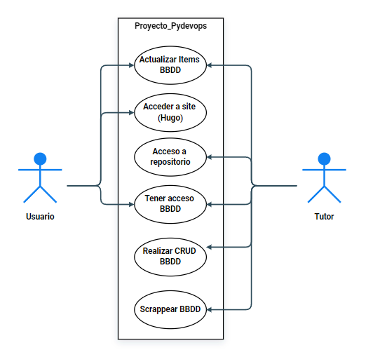
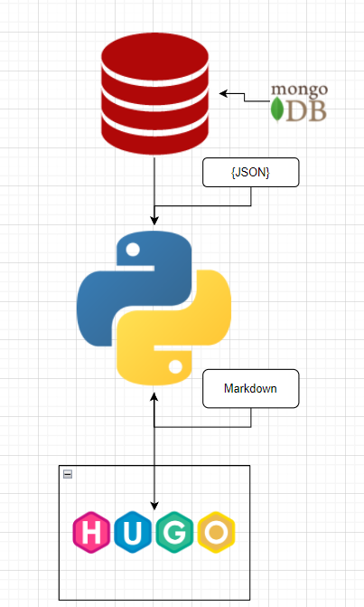
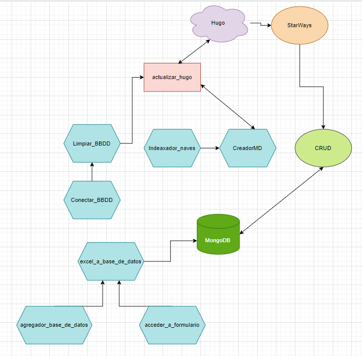

# Proyecto_Pydevops 

>En este repositorio se encuentra nuestro proyecto pydevops, que ha sido fruto del trabajo del primer trimeste de _Formación Profesional de Desarrollo Web_.

## Tabla de contenidos

1. [Introducción](#Introducción)
1. [Metodologías](#Metodologías)
1. [Análisis](#Análisis)
1. [Diseño](#Diseño)
1. [Arquitectura de la aplicación](#Arquitectura-de-la-aplicación)
1. [Pruebas](#Pruebas)
1. [Dificultades](#Dificultades)
1. [Comparación temporal](#Comparación-temporal)
1. [Licencia](#licencia)

--- 

## Introducción

La premisa principal de este proyecto es desarrollar una aplicación Python que sea capaz de extraer los datos de **MongoAtlas** y, teniendo un esquema de los documentos **JSON**, convertirlos a **Markdown**.
De esa forma **Hugo**, un generador de sitios estáticos, leerá los ficheros Markdown y los convertirá en documentos HTML para su página web.

**[⬆ back to top](#tabla-de-contenidos)**

---

## Metodologías

La metodología más cercana al procedimiento que se ha seguido en este trabajo vendría siendo la **metodología Scrum** ya que siendo una metodología ágil, tiene como finalidad la entrega de valor en períodos cortos de tiempo, además estamos más familiarizados con ella. 

Hemos contado con un Product Owner y haciendo uso de _sprints_ van respaldadas dos herramientas claves en el nuestro Scrum: _el product backlog_ y _sprint backlog_.

 - El **Product Backlog**, viene siendo las tareas que engloba todo el proyecto, una biblioteca que nos incluye todas las tareas que debemos realizar con el tiempo de desarrollo estimado. Las tareas que están más arriba deben de ser las de mayor prioridad.

- El **Sprint Backlog** es el grupo de tareas del product backlog que el equipo de desarrollo elige en el sprint planning junto con el plan para poder desarrollarlas. 
El sprint planning no cambia durante el sprint, solo cambia el plan para poder desarrollarlas.

**[⬆ back to top](#tabla-de-contenidos)**

---

## Análisis

Con el software desarrollado por completo, el usuario, como una de las partes interesadas, podrá añadir, actualizar o eliminar un ítem de la base de datos y solo habrá que lanzar este sistema y la web se actualizará de manera automática con los nuevos ítems.

Una vez acordado el esquema JSON que se aplicará a la BBDD, el tutor tendrá acceso a esa BBDD para poder hacer un CRUD sobre el stock de items.

**[⬆ back to top](#tabla-de-contenidos)**

--- 
## Diseño

Teniendo el esquema JSON y el scrapping del tutor en la BBDD, desde Python convertimos esos documentos en Markdown para que Hugo pueda pasarlos a HTML en el Site que genere automáticamente.

**[⬆ back to top](#tabla-de-contenidos)**

---

## Arquitectura de la aplicación

El objetivo de este proyecto es desarrollar una aplicación Python que sea capaz de extraer los datos de **MongoAtlas** y, teniendo un esquema de los documentos **JSON**, convertirlos a **Markdown**.
De esa forma **Hugo**, un generador de sitios estáticos, leerá los ficheros Markdown y los convertirá en documentos HTML para su página web.

Teniendo el esquema JSON y el scrapping del tutor en la BBDD, desde Python convertimos esos documentos en Markdown para que Hugo pueda pasarlos a HTML en el Site que genere automáticamente.

Un esquema de lo que recorre la aplicación:

Diagrama de componentes de este proyecto:

El site generado se ha creado usando el framework [Hugo](https://gohugo.io/) y con la ayuda de una de sus plantillas [Hugo Themes Showcase](https://themes.gohugo.io/).

### Tencologías utilizadas

- Python 3
- CSS3
- HTML5
- MongoAtlas
- Markdown 
- Hugo
- os
- Pymongo

**[⬆ back to top](#tabla-de-contenidos)**

---

## Pruebas

_Más adelante_

**[⬆ back to top](#tabla-de-contenidos)**

---

## Dificultades

_Más adelante_

**[⬆ back to top](#tabla-de-contenidos)**

---

## Comparación temporal

- Estimación real (Clockify)

https://clockify.me/shared/61b66dbc33d0bb38a95fb19b

- Estimacion inicial por tareas

- Comparación temporal

**[⬆ back to top](#tabla-de-contenidos)**

---

## Licencia

MIT License

Copyright (c) 2021 Jouad El Ouardi & Arturo Garrido

Permission is hereby granted, free of charge, to any person obtaining a copy
of this software and associated documentation files (the "Software"), to deal
in the Software without restriction, including without limitation the rights
to use, copy, modify, merge, publish, distribute, sublicense, and/or sell
copies of the Software, and to permit persons to whom the Software is
furnished to do so, subject to the following conditions:

The above copyright notice and this permission notice shall be included in all
copies or substantial portions of the Software.

THE SOFTWARE IS PROVIDED "AS IS", WITHOUT WARRANTY OF ANY KIND, EXPRESS OR
IMPLIED, INCLUDING BUT NOT LIMITED TO THE WARRANTIES OF MERCHANTABILITY,
FITNESS FOR A PARTICULAR PURPOSE AND NONINFRINGEMENT. IN NO EVENT SHALL THE
AUTHORS OR COPYRIGHT HOLDERS BE LIABLE FOR ANY CLAIM, DAMAGES OR OTHER
LIABILITY, WHETHER IN AN ACTION OF CONTRACT, TORT OR OTHERWISE, ARISING FROM,
OUT OF OR IN CONNECTION WITH THE SOFTWARE OR THE USE OR OTHER DEALINGS IN THE
SOFTWARE.

